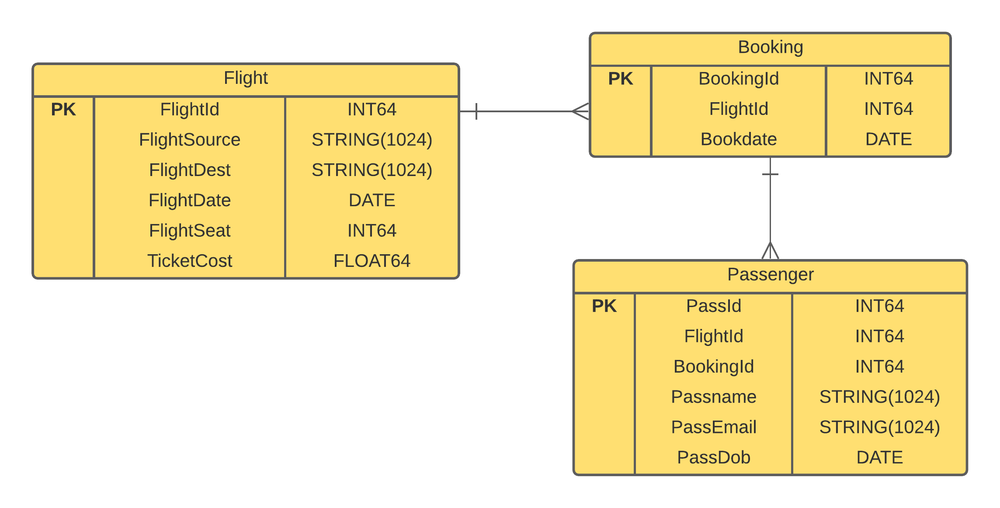

# PROYECTO 1: GOOGLE CLOUD SPANNER

## Documentación del sistema explicando el rediseño de la BDD
Se eligio la estructura de una jerarquia de tabla intercaladas. Por lo cual, la jerarquia se basa en el FlightId. Dado que las lecturas se basaria en el PK de FLightId. 

La lecturas seran mas eficientes en una estructura intercalada. Pero, cuando los datos sean mayores a GB no se recomiendan usar esta estructura.

Ademas, se uso la desnormalizacion para reducir los joins. Dado que si se hace una consulta respecto a una columna que se encuentre en ambas tablas. Su tiempo de consulta se basa en la multiplicacion de las n columnas de las dos tablas.
## Diagrama de la BBD

<p align="center">
  
</p>

## Código DDL del BDD

`Tabla Flights`

```
CREATE TABLE Flights (
  FlightId INT64 NOT NULL,
  FlightSource STRING(1024),
  FlightDest STRING(1024),
  FlightDate DATE,
  FlightSeat INT64 NOT NULL,
  TicketCost FLOAT64 NOT NULL,
) PRIMARY KEY(FlightId);
```
`Tabla Bookings`
```
CREATE TABLE Bookings (
  FlightId INT64 NOT NULL,
  BookingId INT64 NOT NULL,
  Bookdate DATE,
) PRIMARY KEY(FlightId, BookingId),
  INTERLEAVE IN PARENT Flights ON DELETE CASCADE;
```
`Tabla Persons`
```
CREATE TABLE Persons (
  FlightId INT64 NOT NULL,
  BookingId INT64 NOT NULL,
  PassId INT64 NOT NULL,
  Passname STRING(1024),
  PassEmail STRING(1024),
  PassDob DATE,
) PRIMARY KEY(FlightId, BookingId, PassId),
  INTERLEAVE IN PARENT Bookings ON DELETE CASCADE;
```

## Código de su API REST
* [Flight](https://github.com/bryapuch/db-2-Parcial-proyecto/blob/main/model/Flight.js)
* [Booking](https://github.com/bryapuch/db-2-Parcial-proyecto/blob/main/model/Bookings.js)
* [Person](https://github.com/bryapuch/db-2-Parcial-proyecto/blob/main/model/Person.js)

## Autores ✒️
* **Bryan Puchaicela** - *Trabajo* - [bryapuch](https://github.com/bryapuch)

* **Aron Caballero** - *Trabajo* - [Josue Caballero](https://github.com/Josue-Caballero)